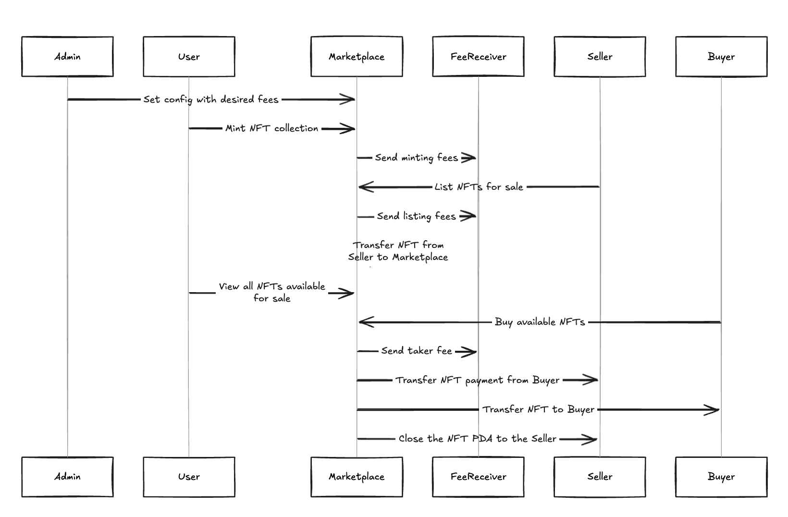

# NFT Marketplace

A digital assets market on Solana where people can buy and sell NFTs with manual order marching.

## Features

- Non-custodial: sellers keep their NFTs until someone buys them
- Manual order matching: buyers choose which NFT to purchase
- Configurable fees: admin sets minting, maker, and taker fees
- On-chain: all transactions happen directly on Solana
- Fee splitting: marketplace takes a percentage, rest goes to seller

## User Stories

This program manages a Market where:

- As an admin I can set up & update the Market with desired fees
- As a Sellers I can list my NFTs for sale on the Marketplace
- As a Buyers I can list all NFTS in platform and purchase anyone on sale
- As a the fee recipient I can receive fees for all transactions in the market

## Sequence Flow



## Build

```bash
anchor build
```

## Test

```bash
cargo test -- --show-output
```

## Deploy

```bash
anchor deploy
```

## Known issues

- mpl-core dependency shows stack warnings during build (doesn't affect functionality)

